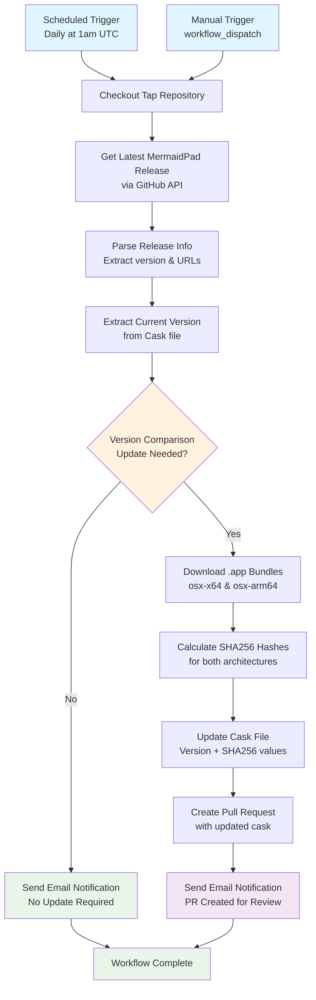

# GitHub Workflow Documentation

This directory contains automated workflows that maintain the homebrew-tap repository.

## Update Cask Workflow

The `update-cask.yml` workflow automatically keeps the MermaidPad Homebrew cask synchronized with new releases from the main MermaidPad repository.

### Workflow Process



### Workflow Components

#### Triggers
- **Scheduled**: Runs daily at 1:00 AM UTC
- **Manual**: Can be triggered via GitHub Actions UI

#### Security
- Restricted to repository owner (`udlose`) only
- Uses GitHub API with standard permissions
- Email notifications via SMTP secrets

#### Update Logic
1. **Version Detection**: Compares semantic versions using regex validation
2. **Asset Download**: Fetches both x64 and ARM64 .app.zip files
3. **Hash Verification**: Calculates SHA256 checksums for security
4. **Atomic Updates**: Updates version, Intel hash, and ARM hash in single commit

#### File Operations
```ruby
# Cask file pattern (Casks/mermaidpad.rb)
cask "mermaidpad" do
  version "1.0.4"                    # <- Updated by workflow
  arch arm: "arm64", intel: "x64"

  sha256 arm:   "e115fb8...",        # <- Updated by workflow
         intel: "e1472dd..."         # <- Updated by workflow

  url "https://github.com/udlose/MermaidPad/releases/download/v#{version}/MermaidPad-#{version}-osx-#{arch}.app.zip"
  # ... rest of cask definition
end
```

#### Error Handling
- **Version Validation**: Strict semver regex prevents malformed versions
- **Asset Verification**: Confirms download URLs exist before processing
- **Fallback Notifications**: Email alerts for both success and failure cases

#### Integration Points
- **GitHub API**: Fetches release information from `udlose/MermaidPad`
- **SMTP**: Sends status notifications via configured email service
- **Git**: Creates feature branches and pull requests for review

### Maintenance

The workflow is designed to be fully autonomous, requiring intervention only when:
- MermaidPad changes its release asset naming convention
- GitHub API rate limits are exceeded
- SMTP configuration needs updates

All updates go through pull request review before being merged to the main branch, ensuring quality control while maintaining automation.